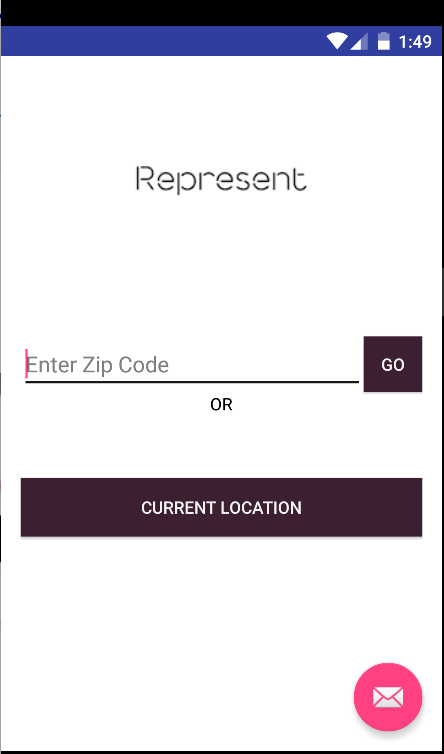
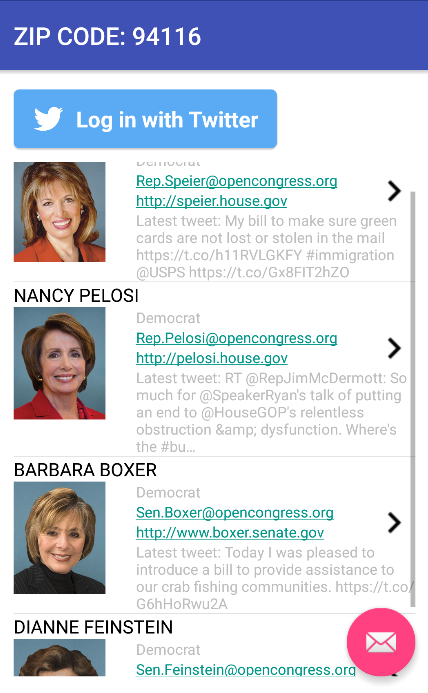
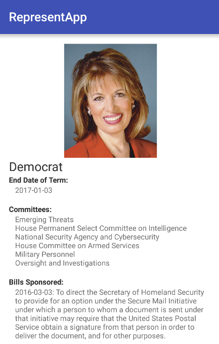
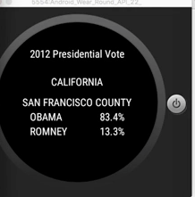

# PROG 02: Represent!

An Phone to watch connected app to deliver facts to voters. The app made use of the Sunlight API, Google Map Geocoding API, Farbic API, Twitter API, etc. 

## Authors

Winnie Wen ([wiwen@berkeley.edu](mailto:wiwen@berkeley.edu))

## Demo Video

See Represent Prog-2C (https://www.youtube.com/watch?v=XH7fzg9Qdv0)

## Screenshots

## Acknowledgments

Catnip creator
StackOverflow
